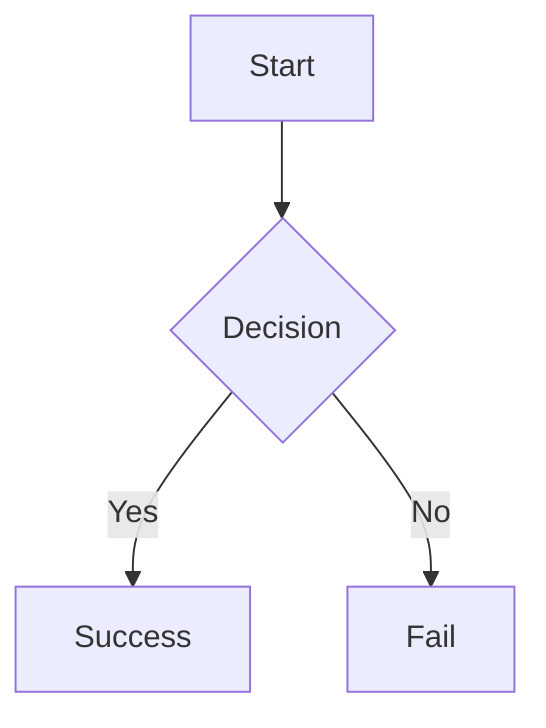

# 🎯 Extended Components Guide

## New Features Added

We've added **10 powerful components** from the vidh_learn integration to make `gpt_markdown` even more feature-rich!

---

## Extended Markdown Components

### 1. GitHub Alerts 🎨

Render beautiful alert boxes with color-coded styling:

```markdown
> [!NOTE]
> This is an informational note

> [!TIP]
> Here's a helpful tip!

> [!IMPORTANT]
> Pay attention to this!

> [!WARNING]
> Be careful with this

> [!CAUTION]
> Danger! Proceed with caution
```

**Auto-included in `PremiumGptMarkdown`** ✅

---

### 2. Task Lists ✅

Enhanced task lists with visual status:

```markdown
- [x] Completed task
- [ ] Pending task
- [x] Another done task
```

**Auto-included in `PremiumGptMarkdown`** ✅

---

### 3. Mermaid Diagrams 📊

Render beautiful diagrams:

````markdown

````

**Auto-included in `PremiumGptMarkdown`** ✅

---

### 4. Footnotes 📝

Academic-style footnotes:

```markdown
This text has a footnote[^1].

[^1]: This is the footnote content.
```

**Auto-included in `PremiumGptMarkdown`** ✅

---

### 5. Enhanced Horizontal Rules —

Beautiful gradient dividers:

```markdown
---
```

**Auto-included in `PremiumGptMarkdown`** ✅

---

## HTML Tag Support

### 6. Line Breaks

```markdown
First line<br>Second line<br/>Third line
```

### 7. Keyboard Keys

```markdown
Press <kbd>Ctrl</kbd> + <kbd>C</kbd> to copy
```

### 8. Highlighted Text

```markdown
This is <mark>highlighted</mark> text
```

### 9. Underlined Text

```markdown
This is <u>underlined</u> text
```

**All auto-included in `PremiumGptMarkdown`** ✅

---

## Usage

### Option 1: One-Line Setup (Recommended) ⭐

```dart
import 'package:gpt_markdown/premium_markdown.dart';

PremiumGptMarkdown(
  yourMarkdownText,
  showReadingTime: true,
  enableAnimations: true,
)
```

**Benefits:**
- ✅ All extended components included
- ✅ All premium features enabled
- ✅ Enhanced code blocks, images, tables
- ✅ Smart typography
- ✅ TTS support
- ✅ Error handling built-in

---

### Option 2: Manual Setup (Advanced)

```dart
import 'package:gpt_markdown/gpt_markdown.dart';
import 'package:gpt_markdown/custom_widgets/extended_components.dart';

GptMarkdown(
  yourMarkdownText,
  components: [
    ...getExtendedComponents(),
    ...MarkdownComponent.globalComponents,
  ],
  inlineComponents: [
    ...getExtendedInlineComponents(),
    ...MarkdownComponent.inlineComponents,
  ],
)
```

---

### Option 3: Selective Components

```dart
import 'package:gpt_markdown/custom_widgets/extended_components.dart';

// Only include specific components
GptMarkdown(
  yourMarkdownText,
  components: [
    GitHubAlertComponent(),
    MermaidComponent(),
    // ... add others as needed
    ...MarkdownComponent.globalComponents,
  ],
  inlineComponents: [
    HtmlLineBreakComponent(),
    HtmlKbdComponent(),
    // ... add others as needed
    ...MarkdownComponent.inlineComponents,
  ],
)
```

---

## Component List

### Block Components

| Component | Syntax | Auto-included |
|-----------|--------|---------------|
| `GitHubAlertComponent` | `> [!NOTE]` | ✅ |
| `TaskListComponent` | `- [x]` | ✅ |
| `MermaidComponent` | ` ```mermaid` | ✅ |
| `FootnoteComponent` | `[^1]` | ✅ |
| `EnhancedHorizontalRuleComponent` | `---` | ✅ |

### Inline Components

| Component | Syntax | Auto-included |
|-----------|--------|---------------|
| `HtmlLineBreakComponent` | `<br>` | ✅ |
| `HtmlUnderlineComponent` | `<u>text</u>` | ✅ |
| `HtmlMarkComponent` | `<mark>text</mark>` | ✅ |
| `HtmlKbdComponent` | `<kbd>key</kbd>` | ✅ |

---

## Premium Features Comparison

| Feature | Basic GptMarkdown | PremiumGptMarkdown |
|---------|-------------------|-------------------|
| GitHub Alerts | ❌ | ✅ |
| Task Lists | ❌ | ✅ |
| Mermaid Diagrams | ❌ | ✅ |
| Footnotes | ❌ | ✅ |
| HTML Tags | ❌ | ✅ |
| Enhanced Code Blocks | ❌ | ✅ |
| Enhanced Images | ❌ | ✅ |
| Enhanced Tables | ❌ | ✅ |
| Smart Typography | ❌ | ✅ |
| Reading Time | ❌ | ✅ |
| Table of Contents | ❌ | ✅ |
| Animations | ❌ | ✅ |
| TTS Support | ❌ | ✅ |

---

## TTS Extraction

Extract voice-optimized text from markdown:

```dart
import 'package:gpt_markdown/premium_markdown.dart';

// Extract clean text for TTS
final voiceText = PremiumGptMarkdown.extractVoiceText(
  markdown,
  addNaturalPauses: true,
  expandAbbreviations: true,
);

// Generate SSML for advanced TTS
final ssml = PremiumGptMarkdown.generateSSML(
  markdown,
  rate: 1.0,
  pitch: 1.0,
);
```

---

## Migration Guide

### From vidh_learn Custom Components

**Before:**
```dart
// In your app
import 'premium_markdown_components.dart';

final components = getPremiumMarkdownComponents();
final inlineComponents = getPremiumInlineComponents();

GptMarkdown(
  text,
  components: [...components, ...defaults],
  inlineComponents: [...inlineComponents, ...defaults],
)
```

**After:**
```dart
// One line!
import 'package:gpt_markdown/premium_markdown.dart';

PremiumGptMarkdown(text)
```

**Benefits:**
- ✅ 90% less code
- ✅ Built-in error handling
- ✅ All features included
- ✅ Better performance
- ✅ Easier maintenance

---

## Examples

See `example/lib/premium_example.dart` for a complete demo featuring:
- All extended components
- Premium themes
- Glassmorphism effects
- Interactive theme switcher
- Real markdown samples

Run it:
```bash
cd example
flutter run lib/premium_example.dart
```

---

## API Reference

### PremiumGptMarkdown

```dart
PremiumGptMarkdown(
  String data, {
  
  // Styling
  TextStyle? style,
  
  // Features
  bool showReadingTime = false,
  bool showTableOfContents = false,
  bool enableAnimations = true,
  bool enableInteractiveGestures = false,
  bool useDollarSignsForLatex = true,
  
  // TTS Highlighting
  int? currentReadingBlockIndex,
  Color? readingHighlightColor,
  int? currentWordIndex,
  Map<int, List<int>>? blockWordRanges,
  Color? currentWordHighlightColor,
  
  // Custom Builders (optional overrides)
  Widget Function(...)? codeBuilder,
  Widget Function(...)? imageBuilder,
  Widget Function(...)? tableBuilder,
  Widget Function(...)? linkBuilder,
  Widget Function(...)? latexBuilder,
  
  // Footnotes
  FootnoteManager? footnoteManager,
})
```

---

## What's Next?

Check out the other premium features:
- [Glassmorphism Effects](glassmorphism_effects.dart)
- [Premium Themes](premium_themes.dart)
- [Magnetic Interactions](magnetic_interactions.dart)
- [Content Animations](content_animations.dart)

---

**Made with ❤️ for the Flutter community** 🚀
